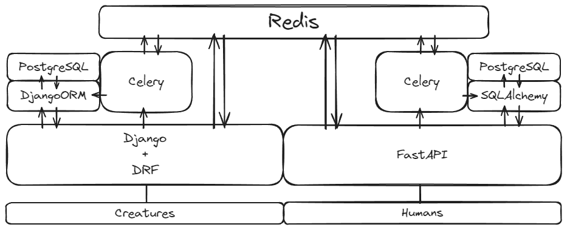

# creature_vs_humanity

## Описание

Проект представляет собой игру про борьбу существ (creatures) и людей (humans). "Существа" созданы на основе фреймворка Django, а "люди" - FastAPI.

## Установка и запуск

Клонировать репозиторий

```bash
git clone https://github.com/NovoselovSV/creature_vs_humanity.git
```

 1. Создать, активировать виртуальное окружение и установить зависимости для:
     1. части creatures
         ```bash
         cd path/to/repo/creatures
         ```
         ```bash
         python3 -m venv venv
         ```
         ```bash
         source env/bin/activate
         ```
         ```bash
         python3 -m pip install --upgrade pip
         ```
         ```bash
         pip install -r requirements.txt
         ```
         
     2. части humans
         ```bash
         cd path/to/repo/humans
         ```
         ```bash
         python3 -m venv venv
         ```
         ```bash
         source env/bin/activate
         ```
         ```bash
         python3 -m pip install --upgrade pip
         ```
         ```bash
         pip install -r requirements.txt
         ```

 2. Запуск проекта:

     1. перейти в папку infra
         ```bash
         cd path/to/repo/infra
         ```
     2. (Опционально) создать файл .env в который поместите следующее содержание, заменяя угловые скобки (<>) и то что в них на соответствующие значения.
         ```
         DEBUG=<True если значение True, False иначе (по умолчанию True)>
         REDIS_URL=<Адрес redis сервера (по умолчанию redis://redis:6379)>
         BEAST_SALT=<Соль для проверки сообщения от beast части (по умолчанию I\'m the beast)>
         HUMANS_SALT=<Соль для проверки сообщения от humans части (по умолчанию I\'m only human)>
         HUMANS_PORT=<Порт части humans (по умолчанию 8000)>
         HUMANS_HOST=<Адрес части humans (http://humans)>
         BEAST_PORT=<Порт части beast (по умолчанию 8000)>
         BEAST_HOST=<Адрес части beast (http://creatures)>
         SECRET_KEY=<Секретный ключ>
         ALLOWED_HOSTS=<Хосты, на которых допустима работа бэкенда, перечисляются через пробел (на локальной машине можно установать 'localhost 127.0.0.1' без ковычек, или удалить данную строку, в последнем случае будут допустимы любые хосты - '*')>
         DB_HUMANS_DB=<Название бд в PostgresDB для humans части (по умолчанию humans)>
         DB_HUMANS_USERNAME=<Username суперпользователя для контейнера PostgresDB для humans части (по умолчанию postgres)>
         DB_HUMANS_PASSWORD=<Пароль суперпользователя для DB_HUMANS_USERNAME для humans части (по умолчанию postgres)>
         DB_HUMANS_HOST=<Адрес по которому бэкенд humans части будет соединяться с базой данных (по умолчанию db_humans)>
         DB_HUMANS_PORT=<Порт DB_HUMANS_HOST (по умолчанию 5432)>
         POSTGRES_CREATURES_DB=<Название бд в PostgresDB для creatures части (по умолчанию creatures)>
         POSTGRES_CREATURES_USERNAME=<Username суперпользователя для контейнера PostgresDB для creatures части (по умолчанию postgres)>
         POSTGRES_CREATURES_PASSWORD=<Пароль суперпользователя для POSTGRES_CREATURES_USERNAME для creatures части (по умолчанию postgres)>
         DB_CREATURES_HOST=<Адрес по которому бэкенд creatures части будет соединяться с базой данных (по умолчанию db_creatures)>
         DB_CREATURES_PORT=<Порт DB_CREATURES_HOST (по умолчанию 5432)>
         ```
     3. запустить docker compose
         ```bash
         [sudo] docker compose up [--build]
         ```
         sudo - для Linux систем;
         --build - в случае изменения кода.
     4. после первого запуска необходимо провести миграции и, желательно, создать суперюзера для обоих проектов и собрать статику и положить ее в видимую nginx папку для creatures проекта
         Для Linux систем есть скрипт after_start.sh в папке infra. При необходимости, применить `chmod +x after_start.sh`.
         Не используя скрипт необходимо вручную выполнить следующие команды:
         ```bash
         [sudo] docker compose exec creatures python manage.py migrate
         [sudo] docker compose exec creatures python manage.py collectstatic
         [sudo] docker compose exec creatures cp -r /app/collected_static/. /creatures_static/static/
         [sudo] docker compose exec humans alembic upgrade head
         [sudo] docker compose exec creatures python manage.py createsuperuser
         [sudo] docker compose exec humans python commands.py
         ```
     Проекты будут доступны на адресах localhost(humans) и localhost:81(creatures)

## Использованные технологии



### Creatures
 1. Django
 2. DRF
 3. Redis
 4. Celery

### Humans
 1. FastAPI
 2. SQLAlchemy
 3. Redis
 4. Celery

## Автор
[Новоселов Сергей](https://github.com/NovoselovSV)
